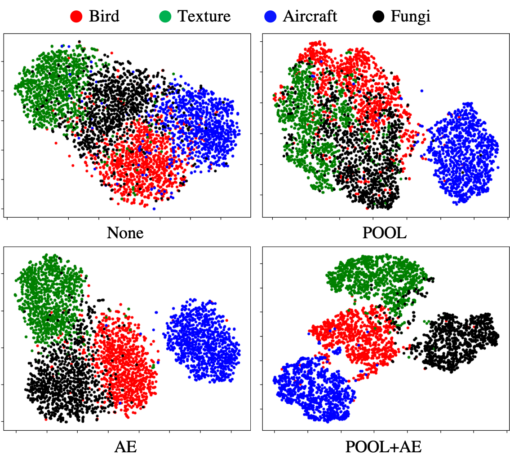

# Meta-learning Amidst Heterogeneity and Ambiguity

## Problem definition

MAHA is a new meta-learning framework that performs robustly amidst heterogeneity and ambiguity. 
Meta-learning aims to handle multiple tasks by efficiently organizing the acquired knowledge. 
However, typical algorithms have been assessed based on a solid assumption which lacks the representative potential in real-world scenarios. 

Among many tackles, we mainly focus on the following two assumptions. 

1. Tasks are regarded to be similar such that a single meta-learner is sufficient to aggregate the variations in all aspects. 
  - There has been little effort to compactly abstract notions within heterogeneity, one of the essential factors characterizing human intelligence
2. There has been less consideration on uncertainty for identifying particular task with a few data points. 
  - It is therefore not easy to analyze or transfer the acquired knowledge of the model, which is critical in the growing AI industries, such as a medical diagnosis and autonomous vehicle.

As a more direct example, see below figure.

When confronting a task for discriminating different types of bird or texture, the data constituting the two tasks at the yellow box is very heterogeneous. 
Hence, there may be a limit to cover all these variations with just a single meta-learner. 
In the case of the green box, tasks are generated in the same way, however, only one image is provided for each class. 
Hence, rather than judging that the two tasks are heterogeneous, there is an incentive to misunderstand, for example, distinguishing between high and low colorfulness, which increases ambiguity on where a feature should be paid attention.

## Methodology

We aim to disentangle the intermediate representation of Neural Process(NP) by dimension-wise pooling and auto-encoding structure.
Additionally, to better leverage the latent variables, we newly devised an encoder-decoder pipeline.
Briefly, overall model diagram is illustrated below.

1. Carry out a pretask to obtain well-clustered and interpretable representation. 
2. Apply an agglomerative clus-tering to the obtained representation without any external knowledge such as the number of clusters.
3. Separately train a different model for each cluster.

Please refer to [paper](https://arxiv.org/pdf/2107.02228.pdf) for more details.

## Experiment

With the multi-step training process, comprehensive experiments are conducted on regression and classification. 

For regression, qualitative comparison of ANP and MAHA on various 1D function types is illustrated. 

The main interest of ANP is shown to fitting the context points, which poorly perform in predicting the target outputs whose corresponding inputs are located farther away from that of the context points. 
This tendency can be observed during interpolation and extrapolation, leading to a wiggly prediction with significant variance. 
By contrast, MAHA can correctly infer the functional shape, which can be confirmed through a consistently low variance.

For classification, t-SNE visualization for the embeddings of four distinct fine-grained image classification datasets is illustrated.

The embeddings get interpretable when using both the dimension-wise pooling and the auto-encoding structure. 
The distinct datasets are no more clearly discriminated without either of them, which is quantitatively demonstrated by the estimated purity values.
We note that the validity of the methodologies stands out particularly in low-shot regime which implies the difficulty of task identification within ambiguity. 

## Conclustion
In the end, we argue that the proposed model captures the task identity with lower variance, leading to a noticeable improvement in performance. 
When training meta-learning models, there comes a customization process based on the problem at hand. 
If not using the benchmark datasets that frequently appear in academia, it becomes unclear to which extent the distinct datasets should be combined, expecting the model to be versatile on every possible task generation. 
MAHA, in this respect, can guide for a human to analyze and cluster the available data into separate clusters. 
Moreover, MAHA mainly benefits future AI industries where the limited communication between the decentralized servers is available as it can infer the global context even with a small amount of information. 
As a result, we do not expect any negative societal impacts, but we believe that MAHA possesses many implications in more realistic scenarios.
